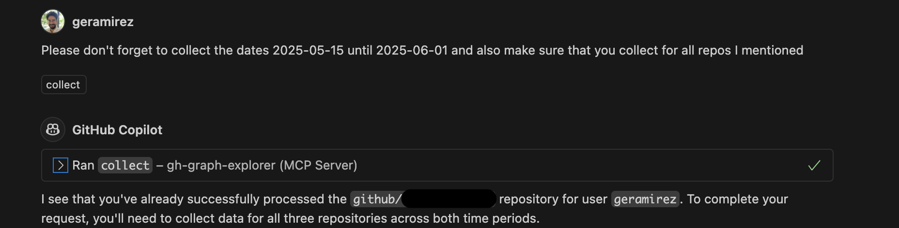
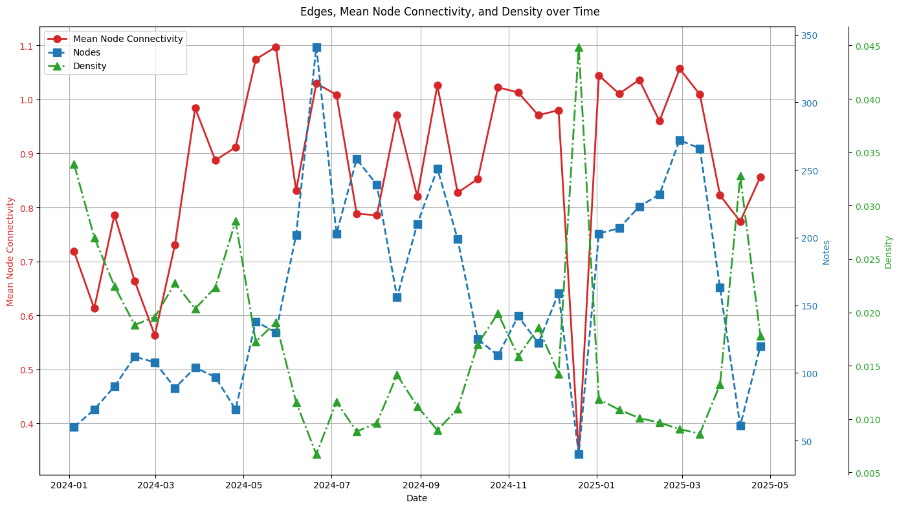
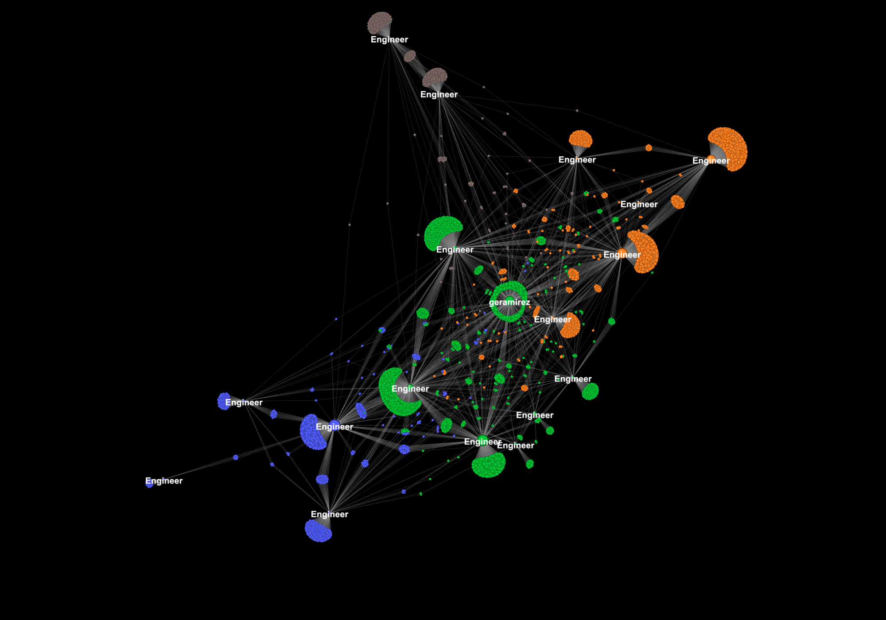
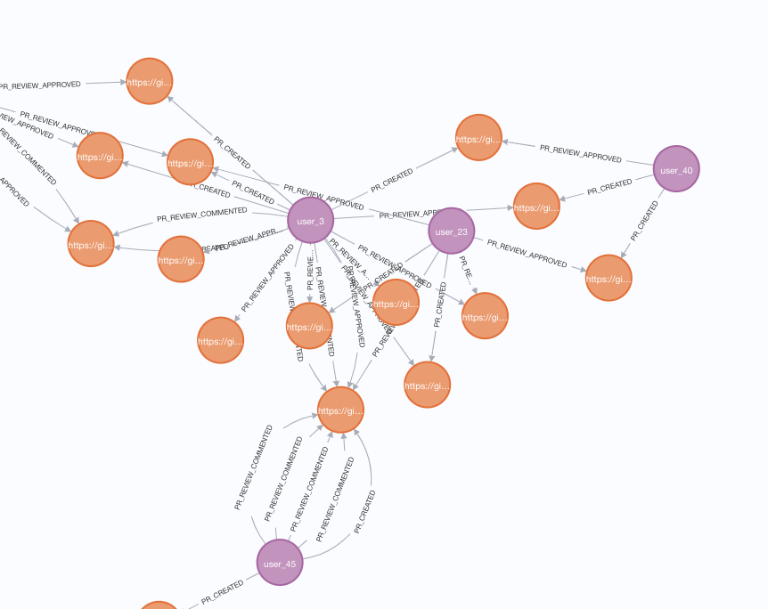
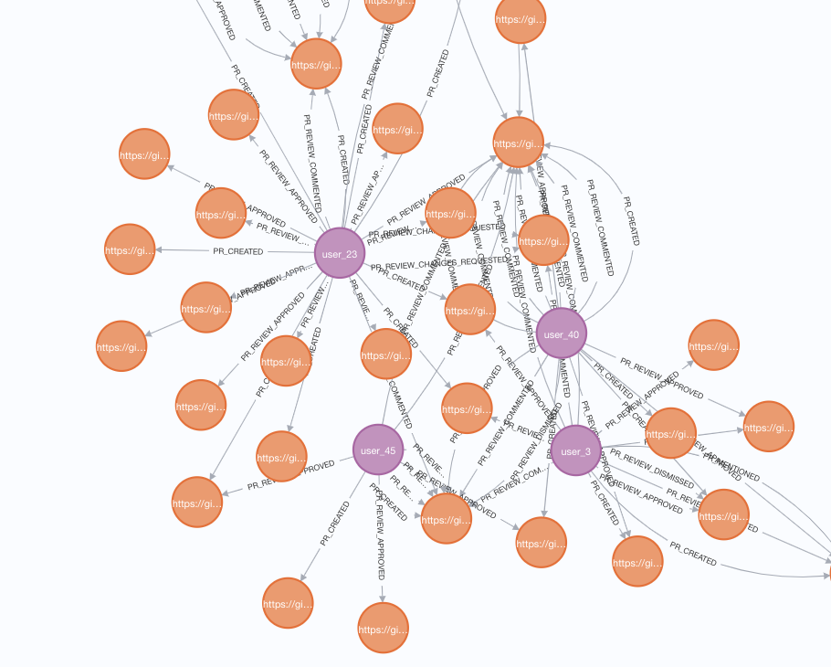
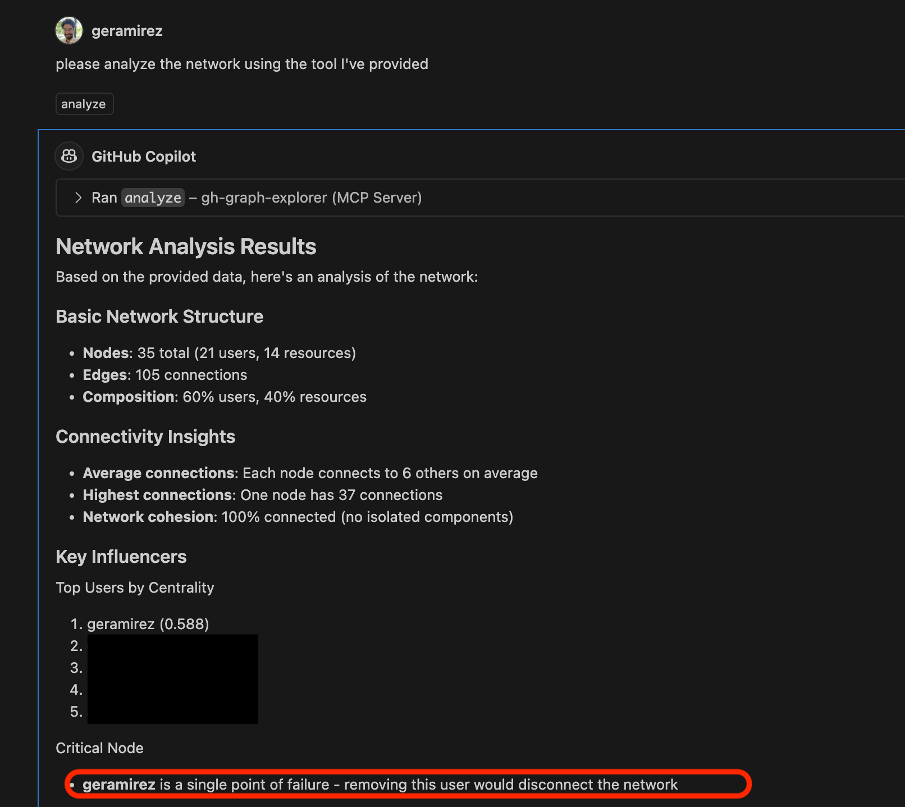
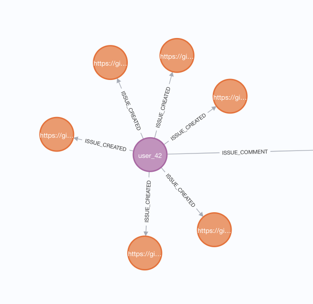
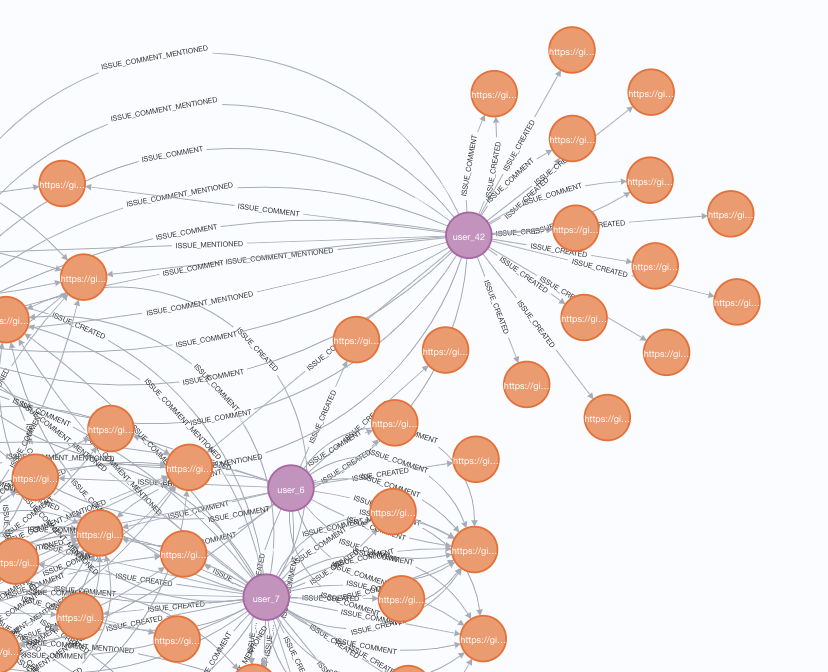

# Beyond the Org Chart: Using Social Network Analysis to tend to Engineering Teams

## Table of Contents

| Section | Description |
|---------|-------------|
| [Cultivating Teams With Social Network Analysis](#cultivating-teams-with-social-network-analysis) | Introduction to SNA and its application |
| [Methodology - How does it work?](#methodology---how-does-it-work) | Tools and workflow overview |
| [Learnings](#learnings) | Key insights from SNA |
| [Limits of Network Analysis](#limits-of-network-analysis) | Discussion of SNA limitations |

As managers, we constantly navigate a dialectical tension between two roles. On the one hand, we have a performance manager. We are asked to lift up high performers and draw clear lines on what we consider low performance. On the other hand, we play the role of cultivator, constantly distributing opportunities and risks while ensuring our teams collaborate and communications lines run smoothly. These roles aren't just different, they are in direct opposition.

For this discussion, I would like to invite you to put aside the performance management lens for a moment and focus entirely on our role as team cultivator.

# Cultivating Teams With Social Network Analysis

Social Network Analysis is a field that I hold dear. My academic background is in Sociology, Anthropology, and Arabic. The only reason I code is because I fell into a cross-disciplinary collaboration with some people in the Computer Science department in graduate school. However, that's a story for another time. 

For the last year and a half, during Days of Learning I've been exploring how to leverage GitHub's "participant network" to build and explore my team's social network I have used the statistics and graphs to better understand my team dynamics and have been able to - to some degree - measure my performance as a team cultivator. 

This past year has further convinced me that our organization charts and even the way we think of top performers are ridges, a mechanical projection of a much more complex, organic system - and understanding this system can help us make better decisions. 

# Methodology - How does it work?

I use a modified version of @inkblotty's [my-work-action](https://github.com/inkblotty/my-work-action). Her useful tool builds weekly markdown reports. [My fork](https://github.com/geramirez/my-work-action) converts that data to edge lists for each of the engineers on our team. I then use an [Ipython notebook](https://github.com/geramirez/gh-graph-explorer/blob/main/notebooks/graph-explorer-template.ipynb) to explore the data and export it to [Gephi](https://gephi.org/) for visualizations.  

More recently, I've created a new [data collection tooling](https://github.com/geramirez/gh-graph-explorer/) that adds support for:

- Collecting at-mentions   
- Adding data for neo4j  
- An MCP server to allow LLMs to explore the data and draw insights

If you're interested in learning more about the tooling [see the repository readme section](https://github.com/geramirez/gh-graph-explorer/?tab=readme-ov-file#graph-explorer).

Also, none of my explorations are "secret." Every couple of weeks, I share insights with the team about our collaboration.

# Learnings

## 1\. Individual cells are only as strong as the invisible pathways that connect them

Members of a team's network are only as relevant as the members who support and connect them to others. We have a bias towards central events and people. We retell history in terms of central figureheads who overcome. This pull is noticeable when we are asked to evaluate our reports and determine who is most impactful and critical. DRIs or leads are central figures; others appear as thank yous and footnotes.  

In reality, dozens of people play a role in projects. We know this as managers, but it's hard to quantify or remember. This past year, while taking time to see the transformation of our team network, it has never been clearer. A lead may write the weekly updates and be the most visible. Still, behind the scenes, many individuals are reviewing PRs, sometimes stopping incidents, watching and responding to monitor alerts to give space for others to concentrate, and connecting people and issues. 

## 2\. Teams thrive when they behave like decentralized Slime Molds rather than chess pieces

Central nodes are very senior individuals on our team. They can bind a team together helping build more robust connections between everyone. They can; however, become too central, too important. It's not inherently negative, it's what we ask of them. Still, I have found that when a very senior engineer takes vacation it forces new connections to form.  People begin collaborating in ways that didn't exist. Just like the slime mold when one pathway is blocked, it develops new routes. A temporary absence of a central person creates the space for new connections to emerge. I have even used this knowledge to make our network more robust. 

For example, I recently created a team of newer engineers who had not been solidified as central nodes. The result was a flurry of new connections and patterns forming.

When I started as a manager, I saw that I was constantly the central node. As the manager of my team, it's unavoidable. Initially, this made me feel like I was doing my job well. But I started to realize that it's actually a red flag. Sometimes, I have to be a central connecting node, but I also need to step back and allow other networks and connections to form. 

Our team has multiple conversations about how to foment decentralized decision-making while ensuring we maintain a cohesive strategy, narrative, and communications. It's challenging and sometimes chaotic, but we're working on it. Ultimately, I believe a decentralized model is the most effective way to solve problems and innovate.

## 3\. Isolation can mean a lot of things

Sometimes, people can be isolated and have few to no connections to the main network. This can mean many things, not all of them negative. Sometimes, we aren't social, and that's okay. 

The charts below only look at issue connections for 2 weeks in April and the second 2 weeks in May.   

Here are some common explanations for isolated nodes. 

1. People are learning and growing   
2. People are on vacation  
3. People are working on a complex problem that requires a lot of thinking.   
4. People can be struggling personally or at work.

Because isolation can mean so many things, we need to take the time to understand each individual situation uniquely as managers. Sometimes interventions are required, other times, simply need to give people space. 

# Limits of Network Analysis

Network analysis can be a powerful tool to understand how engineering teams collaborate, but they have limits. If we take the quantitative network metrics outside of the context that we, as managers, get from direct conversations, they mean nothing. 

Conversations and the flow of ideas can happen in subtle ways that can be difficult to quantify. Sometimes I encourage my engineering to share their thoughts publicly, but these private conversations cannot be captured in these types of analysis. It is precisely for this reason that social network analysis should not be a performance management metric: they present a different perspective but not a universal one. 

I encourage us, instead, to use network analysis as a tool to see our teams from a different point of view, be curious, and ask questions. Using it to rank each other will surely lead to gaming the system, where we would encourage participating in as many conversations as possible, when collaboration also requires a degree of depth, substance, and quality that can't be captured with social network analysis. 

We also have to be mindful of the ethics surrounding these qualitative approaches, especially when we de-contextualize an individual's metrics from the larger system. Remember, social network data can help us understand and improve the systems we create because they reflect the structures we have created, good or bad. Just like I found myself at the central node on the team, the one with the highest centrality, I was also a single point of failure. I achieved individual success at the cost of team resiliency. 

This realization captures why social network analysis should be treated carefully. It's not about optimizing individual metrics or finding the 'best' performers. Instead, it's about understanding the systems we have created and taking responsibility for building better ones.
